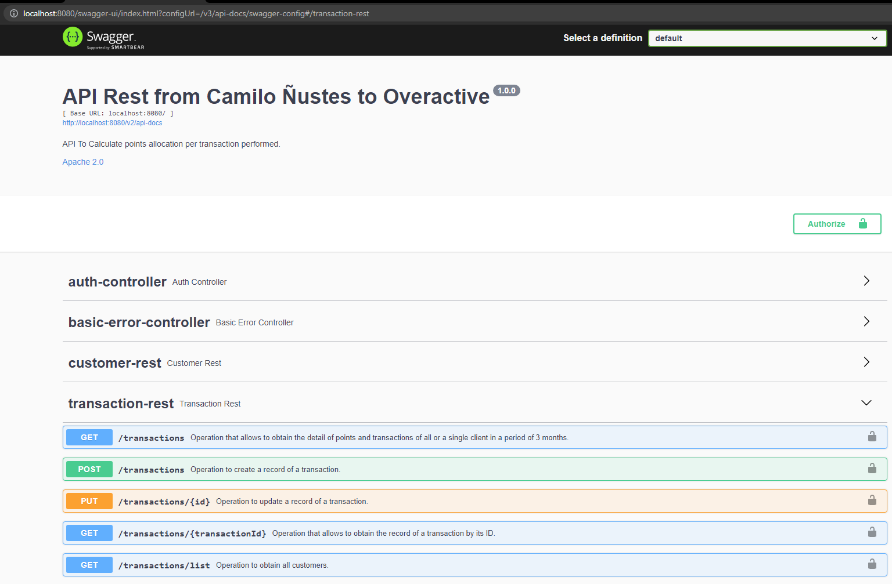
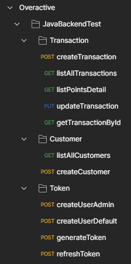
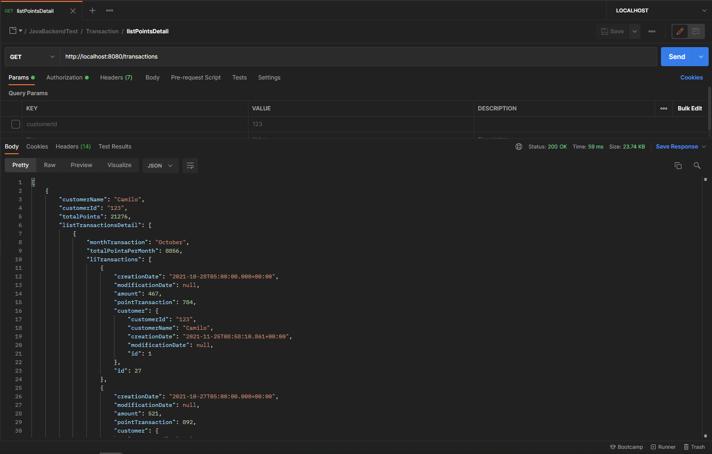

# OveractiveRewardPoints
Exercises to be evaluated by the company Overactive, SpringBoot  + H2 + ApiRest

## Description:
A retailer offers a rewards program to its customers, awarding points based on each recordedpurchase.

A customer receives 2 points for every dollar spent over $100 in each transaction, plus 1 point for every dollar spent over $50 in each transaction (e.g. a $120 purchase = 2x$20 + 1x$50 = 90 points).

Given a record of every transaction during a three month period, calculate the reward points earned for each customer per month and total.

## Goals achieved
1. Code your solution in Java and Spring
2. Make up a data set to best demonstrate your solution
3. Use OOP concepts as much as possible when designing classes.
4. Swagger/OpenAPI (Optional) - helps communicate the contract in a better way
5. Document all response codes expected. The REST API should be sending the appropriate code and not 200 always.
6. Functional Programming constructs of Java 8 as appropriate.
7. Generic exception handler for un-anticipated exceptions.

8. Follow standard best practices for structuring the code.
9. Prepare and provide Test Data along with the code.
10. Implement RestAPI’s for all CRUD operations – in this case – creating/updating transactions, calculating and providing reward information for a User.
11. Use of appropriate logging levels, framework
12. Reward calculation logic should be accurate

## Description of the developed solution:
A Rest API was developed that features security from JWT (Java Web Token). A data.sql file was created which contains the necessary data for the execution of the services, this data is replicated in a H2 embedded database. It also has quick validations such as binding, type and lengths provided by springframework.

## How to Run
### From Eclipse (STS) Using GIT:
1. Open File->Import... and select Git->Git Projects
2. In the next screen, select "Clone URI".
3. We provide the url of the repository in the URI field, the rest will be filled in automatically.
4. After clicking Next> , Eclipse will connect to the repository and show the branches, you must select "dev".
5. Indicate the location where you want to download the project.
6. Clicking Next> will download the repository to the chosen location. We can import the project into Eclipse using option 3 "Import as general project".

### From CMD
1. Download the project in .zip from the "dev" branch.
2. Extract in directory.
3. Use the mvnw.cmd command to execute maven commands and compile, install dependencies.
4. Execute mvnw install which will install all the dependencies at the same time as it compiles the application.
5. Use java -jar targetwebapp2-0.0.1-SNAPSHOT.jar to start the application.

## Evidence of development
1. Creation of the SWAGGER with the help of springfox
<p align="center"></p>

2. The PostMan collection with the execution of the tests is enclosed by mail.
<p align="center"></p>

3. Execution of the CORE service which is responsible for listing the transactions of the last 3 months along with their total points.
<p align="center"></p>

```json
[
    {
        "customerName": "Camilo",
        "customerId": "123",
        "totalPoints": 21276,
        "listTransactionsDetail": [
            {
                "monthTransaction": "October",
                "totalPointsPerMonth": 8856,
                "liTransactions": [
                    {
                        "creationDate": "2021-10-28T05:00:00.000+00:00",
                        "modificationDate": null,
                        "amount": 467,
                        "pointTransaction": 784,
                        "customer": {
                            "customerId": "123",
                            "customerName": "Camilo",
                            "creationDate": "2021-11-25T08:58:10.861+00:00",
                            "modificationDate": null,
                            "id": 1
                        },
                        "id": 27
                    },
                    {
                        "creationDate": "2021-10-27T05:00:00.000+00:00",
                        "modificationDate": null,
                        "amount": 521,
                        "pointTransaction": 892,
                        "customer": {
                            "customerId": "123",
                            "customerName": "Camilo",
                            "creationDate": "2021-11-25T08:58:10.861+00:00",
                            "modificationDate": null,
                            "id": 1
                        },
                        "id": 28
                    },
                    {
                        "creationDate": "2021-10-26T05:00:00.000+00:00",
                        "modificationDate": null,
                        "amount": 618,
                        "pointTransaction": 1086,
                        "customer": {
                            "customerId": "123",
                            "customerName": "Camilo",
                            "creationDate": "2021-11-25T08:58:10.861+00:00",
                            "modificationDate": null,
                            "id": 1
                        },
                        "id": 29
                    },
                    {
                        "creationDate": "2021-10-25T05:00:00.000+00:00",
                        "modificationDate": null,
                        "amount": 986,
                        "pointTransaction": 1822,
                        "customer": {
                            "customerId": "123",
                            "customerName": "Camilo",
                            "creationDate": "2021-11-25T08:58:10.861+00:00",
                            "modificationDate": null,
                            "id": 1
                        },
                        "id": 30
                    },
                    {
                        "creationDate": "2021-10-24T05:00:00.000+00:00",
                        "modificationDate": null,
                        "amount": 1105,
                        "pointTransaction": 2060,
                        "customer": {
                            "customerId": "123",
                            "customerName": "Camilo",
                            "creationDate": "2021-11-25T08:58:10.861+00:00",
                            "modificationDate": null,
                            "id": 1
                        },
                        "id": 31
                    },
                    {
                        "creationDate": "2021-10-23T05:00:00.000+00:00",
                        "modificationDate": null,
                        "amount": 723,
                        "pointTransaction": 1296,
                        "customer": {
                            "customerId": "123",
                            "customerName": "Camilo",
                            "creationDate": "2021-11-25T08:58:10.861+00:00",
                            "modificationDate": null,
                            "id": 1
                        },
                        "id": 32
                    },
                    {
                        "creationDate": "2021-10-22T05:00:00.000+00:00",
                        "modificationDate": null,
                        "amount": 533,
                        "pointTransaction": 916,
                        "customer": {
                            "customerId": "123",
                            "customerName": "Camilo",
                            "creationDate": "2021-11-25T08:58:10.861+00:00",
                            "modificationDate": null,
                            "id": 1
                        },
                        "id": 33
                    }
                ]
            },
            {
                "monthTransaction": "September",
                "totalPointsPerMonth": 5196,
                "liTransactions": [
                    {
                        "creationDate": "2021-09-28T05:00:00.000+00:00",
                        "modificationDate": null,
                        "amount": 1062,
                        "pointTransaction": 1974,
                        "customer": {
                            "customerId": "123",
                            "customerName": "Camilo",
                            "creationDate": "2021-11-25T08:58:10.861+00:00",
                            "modificationDate": null,
                            "id": 1
                        },
                        "id": 57
                    },
                    {
                        "creationDate": "2021-09-27T05:00:00.000+00:00",
                        "modificationDate": null,
                        "amount": 527,
                        "pointTransaction": 904,
                        "customer": {
                            "customerId": "123",
                            "customerName": "Camilo",
                            "creationDate": "2021-11-25T08:58:10.861+00:00",
                            "modificationDate": null,
                            "id": 1
                        },
                        "id": 58
                    },
                    {
                        "creationDate": "2021-09-26T05:00:00.000+00:00",
                        "modificationDate": null,
                        "amount": 652,
                        "pointTransaction": 1154,
                        "customer": {
                            "customerId": "123",
                            "customerName": "Camilo",
                            "creationDate": "2021-11-25T08:58:10.861+00:00",
                            "modificationDate": null,
                            "id": 1
                        },
                        "id": 59
                    },
                    {
                        "creationDate": "2021-09-25T05:00:00.000+00:00",
                        "modificationDate": null,
                        "amount": 657,
                        "pointTransaction": 1164,
                        "customer": {
                            "customerId": "123",
                            "customerName": "Camilo",
                            "creationDate": "2021-11-25T08:58:10.861+00:00",
                            "modificationDate": null,
                            "id": 1
                        },
                        "id": 60
                    }
                ]
            },
            {
                "monthTransaction": "November",
                "totalPointsPerMonth": 3874,
                "liTransactions": [
                    {
                        "creationDate": "2021-11-24T05:00:00.000+00:00",
                        "modificationDate": null,
                        "amount": 185,
                        "pointTransaction": 220,
                        "customer": {
                            "customerId": "123",
                            "customerName": "Camilo",
                            "creationDate": "2021-11-25T08:58:10.861+00:00",
                            "modificationDate": null,
                            "id": 1
                        },
                        "id": 1
                    },
                    {
                        "creationDate": "2021-11-23T05:00:00.000+00:00",
                        "modificationDate": null,
                        "amount": 115,
                        "pointTransaction": 80,
                        "customer": {
                            "customerId": "123",
                            "customerName": "Camilo",
                            "creationDate": "2021-11-25T08:58:10.861+00:00",
                            "modificationDate": null,
                            "id": 1
                        },
                        "id": 2
                    },
                    {
                        "creationDate": "2021-11-22T05:00:00.000+00:00",
                        "modificationDate": null,
                        "amount": 674,
                        "pointTransaction": 1198,
                        "customer": {
                            "customerId": "123",
                            "customerName": "Camilo",
                            "creationDate": "2021-11-25T08:58:10.861+00:00",
                            "modificationDate": null,
                            "id": 1
                        },
                        "id": 3
                    },
                    {
                        "creationDate": "2021-11-21T05:00:00.000+00:00",
                        "modificationDate": null,
                        "amount": 322,
                        "pointTransaction": 494,
                        "customer": {
                            "customerId": "123",
                            "customerName": "Camilo",
                            "creationDate": "2021-11-25T08:58:10.861+00:00",
                            "modificationDate": null,
                            "id": 1
                        },
                        "id": 4
                    },
                    {
                        "creationDate": "2021-11-20T05:00:00.000+00:00",
                        "modificationDate": null,
                        "amount": 1016,
                        "pointTransaction": 1882,
                        "customer": {
                            "customerId": "123",
                            "customerName": "Camilo",
                            "creationDate": "2021-11-25T08:58:10.861+00:00",
                            "modificationDate": null,
                            "id": 1
                        },
                        "id": 5
                    }
                ]
            },
            {
                "monthTransaction": "August",
                "totalPointsPerMonth": 3350,
                "liTransactions": [
                    {
                        "creationDate": "2021-08-30T05:00:00.000+00:00",
                        "modificationDate": null,
                        "amount": 675,
                        "pointTransaction": 1200,
                        "customer": {
                            "customerId": "123",
                            "customerName": "Camilo",
                            "creationDate": "2021-11-25T08:58:10.861+00:00",
                            "modificationDate": null,
                            "id": 1
                        },
                        "id": 86
                    },
                    {
                        "creationDate": "2021-08-29T05:00:00.000+00:00",
                        "modificationDate": null,
                        "amount": 1107,
                        "pointTransaction": 2064,
                        "customer": {
                            "customerId": "123",
                            "customerName": "Camilo",
                            "creationDate": "2021-11-25T08:58:10.861+00:00",
                            "modificationDate": null,
                            "id": 1
                        },
                        "id": 87
                    },
                    {
                        "creationDate": "2021-08-28T05:00:00.000+00:00",
                        "modificationDate": null,
                        "amount": 118,
                        "pointTransaction": 86,
                        "customer": {
                            "customerId": "123",
                            "customerName": "Camilo",
                            "creationDate": "2021-11-25T08:58:10.861+00:00",
                            "modificationDate": null,
                            "id": 1
                        },
                        "id": 88
                    }
                ]
            }
        ]
    },
    {
        "customerName": "Andres",
        "customerId": "321",
        "totalPoints": 34965,
        "listTransactionsDetail": [
            {
                "monthTransaction": "October",
                "totalPointsPerMonth": 12946,
                "liTransactions": [
                    {
                        "creationDate": "2021-10-21T05:00:00.000+00:00",
                        "modificationDate": null,
                        "amount": 24,
                        "pointTransaction": 0,
                        "customer": {
                            "customerId": "321",
                            "customerName": "Andres",
                            "creationDate": "2021-11-25T08:58:10.868+00:00",
                            "modificationDate": null,
                            "id": 2
                        },
                        "id": 34
                    },
                    {
                        "creationDate": "2021-10-20T05:00:00.000+00:00",
                        "modificationDate": null,
                        "amount": 30,
                        "pointTransaction": 0,
                        "customer": {
                            "customerId": "321",
                            "customerName": "Andres",
                            "creationDate": "2021-11-25T08:58:10.868+00:00",
                            "modificationDate": null,
                            "id": 2
                        },
                        "id": 35
                    },
                    {
                        "creationDate": "2021-10-19T05:00:00.000+00:00",
                        "modificationDate": null,
                        "amount": 531,
                        "pointTransaction": 912,
                        "customer": {
                            "customerId": "321",
                            "customerName": "Andres",
                            "creationDate": "2021-11-25T08:58:10.868+00:00",
                            "modificationDate": null,
                            "id": 2
                        },
                        "id": 36
                    },
                    {
                        "creationDate": "2021-10-18T05:00:00.000+00:00",
                        "modificationDate": null,
                        "amount": 1142,
                        "pointTransaction": 2134,
                        "customer": {
                            "customerId": "321",
                            "customerName": "Andres",
                            "creationDate": "2021-11-25T08:58:10.868+00:00",
                            "modificationDate": null,
                            "id": 2
                        },
                        "id": 37
                    },
                    {
                        "creationDate": "2021-10-17T05:00:00.000+00:00",
                        "modificationDate": null,
                        "amount": 1030,
                        "pointTransaction": 1910,
                        "customer": {
                            "customerId": "321",
                            "customerName": "Andres",
                            "creationDate": "2021-11-25T08:58:10.868+00:00",
                            "modificationDate": null,
                            "id": 2
                        },
                        "id": 38
                    },
                    {
                        "creationDate": "2021-10-08T05:00:00.000+00:00",
                        "modificationDate": null,
                        "amount": 477,
                        "pointTransaction": 804,
                        "customer": {
                            "customerId": "321",
                            "customerName": "Andres",
                            "creationDate": "2021-11-25T08:58:10.868+00:00",
                            "modificationDate": null,
                            "id": 2
                        },
                        "id": 47
                    },
                    {
                        "creationDate": "2021-10-07T05:00:00.000+00:00",
                        "modificationDate": null,
                        "amount": 779,
                        "pointTransaction": 1408,
                        "customer": {
                            "customerId": "321",
                            "customerName": "Andres",
                            "creationDate": "2021-11-25T08:58:10.868+00:00",
                            "modificationDate": null,
                            "id": 2
                        },
                        "id": 48
                    },
                    {
                        "creationDate": "2021-10-06T05:00:00.000+00:00",
                        "modificationDate": null,
                        "amount": 862,
                        "pointTransaction": 1574,
                        "customer": {
                            "customerId": "321",
                            "customerName": "Andres",
                            "creationDate": "2021-11-25T08:58:10.868+00:00",
                            "modificationDate": null,
                            "id": 2
                        },
                        "id": 49
                    },
                    {
                        "creationDate": "2021-10-05T05:00:00.000+00:00",
                        "modificationDate": null,
                        "amount": 559,
                        "pointTransaction": 968,
                        "customer": {
                            "customerId": "321",
                            "customerName": "Andres",
                            "creationDate": "2021-11-25T08:58:10.868+00:00",
                            "modificationDate": null,
                            "id": 2
                        },
                        "id": 50
                    },
                    {
                        "creationDate": "2021-10-04T05:00:00.000+00:00",
                        "modificationDate": null,
                        "amount": 771,
                        "pointTransaction": 1392,
                        "customer": {
                            "customerId": "321",
                            "customerName": "Andres",
                            "creationDate": "2021-11-25T08:58:10.868+00:00",
                            "modificationDate": null,
                            "id": 2
                        },
                        "id": 51
                    },
                    {
                        "creationDate": "2021-10-03T05:00:00.000+00:00",
                        "modificationDate": null,
                        "amount": 997,
                        "pointTransaction": 1844,
                        "customer": {
                            "customerId": "321",
                            "customerName": "Andres",
                            "creationDate": "2021-11-25T08:58:10.868+00:00",
                            "modificationDate": null,
                            "id": 2
                        },
                        "id": 52
                    }
                ]
            },
            {
                "monthTransaction": "September",
                "totalPointsPerMonth": 10749,
                "liTransactions": [
                    {
                        "creationDate": "2021-09-20T05:00:00.000+00:00",
                        "modificationDate": null,
                        "amount": 1155,
                        "pointTransaction": 2160,
                        "customer": {
                            "customerId": "321",
                            "customerName": "Andres",
                            "creationDate": "2021-11-25T08:58:10.868+00:00",
                            "modificationDate": null,
                            "id": 2
                        },
                        "id": 65
                    },
                    {
                        "creationDate": "2021-09-19T05:00:00.000+00:00",
                        "modificationDate": null,
                        "amount": 1206,
                        "pointTransaction": 2262,
                        "customer": {
                            "customerId": "321",
                            "customerName": "Andres",
                            "creationDate": "2021-11-25T08:58:10.868+00:00",
                            "modificationDate": null,
                            "id": 2
                        },
                        "id": 66
                    },
                    {
                        "creationDate": "2021-09-18T05:00:00.000+00:00",
                        "modificationDate": null,
                        "amount": 63,
                        "pointTransaction": 13,
                        "customer": {
                            "customerId": "321",
                            "customerName": "Andres",
                            "creationDate": "2021-11-25T08:58:10.868+00:00",
                            "modificationDate": null,
                            "id": 2
                        },
                        "id": 67
                    },
                    {
                        "creationDate": "2021-09-17T05:00:00.000+00:00",
                        "modificationDate": null,
                        "amount": 764,
                        "pointTransaction": 1378,
                        "customer": {
                            "customerId": "321",
                            "customerName": "Andres",
                            "creationDate": "2021-11-25T08:58:10.868+00:00",
                            "modificationDate": null,
                            "id": 2
                        },
                        "id": 68
                    },
                    {
                        "creationDate": "2021-09-16T05:00:00.000+00:00",
                        "modificationDate": null,
                        "amount": 961,
                        "pointTransaction": 1772,
                        "customer": {
                            "customerId": "321",
                            "customerName": "Andres",
                            "creationDate": "2021-11-25T08:58:10.868+00:00",
                            "modificationDate": null,
                            "id": 2
                        },
                        "id": 69
                    },
                    {
                        "creationDate": "2021-09-15T05:00:00.000+00:00",
                        "modificationDate": null,
                        "amount": 1,
                        "pointTransaction": 0,
                        "customer": {
                            "customerId": "321",
                            "customerName": "Andres",
                            "creationDate": "2021-11-25T08:58:10.868+00:00",
                            "modificationDate": null,
                            "id": 2
                        },
                        "id": 70
                    },
                    {
                        "creationDate": "2021-09-14T05:00:00.000+00:00",
                        "modificationDate": null,
                        "amount": 623,
                        "pointTransaction": 1096,
                        "customer": {
                            "customerId": "321",
                            "customerName": "Andres",
                            "creationDate": "2021-11-25T08:58:10.868+00:00",
                            "modificationDate": null,
                            "id": 2
                        },
                        "id": 71
                    },
                    {
                        "creationDate": "2021-09-13T05:00:00.000+00:00",
                        "modificationDate": null,
                        "amount": 1109,
                        "pointTransaction": 2068,
                        "customer": {
                            "customerId": "321",
                            "customerName": "Andres",
                            "creationDate": "2021-11-25T08:58:10.868+00:00",
                            "modificationDate": null,
                            "id": 2
                        },
                        "id": 72
                    }
                ]
            },
            {
                "monthTransaction": "November",
                "totalPointsPerMonth": 9048,
                "liTransactions": [
                    {
                        "creationDate": "2021-11-19T05:00:00.000+00:00",
                        "modificationDate": null,
                        "amount": 16,
                        "pointTransaction": 0,
                        "customer": {
                            "customerId": "321",
                            "customerName": "Andres",
                            "creationDate": "2021-11-25T08:58:10.868+00:00",
                            "modificationDate": null,
                            "id": 2
                        },
                        "id": 6
                    },
                    {
                        "creationDate": "2021-11-18T05:00:00.000+00:00",
                        "modificationDate": null,
                        "amount": 181,
                        "pointTransaction": 212,
                        "customer": {
                            "customerId": "321",
                            "customerName": "Andres",
                            "creationDate": "2021-11-25T08:58:10.868+00:00",
                            "modificationDate": null,
                            "id": 2
                        },
                        "id": 7
                    },
                    {
                        "creationDate": "2021-11-17T05:00:00.000+00:00",
                        "modificationDate": null,
                        "amount": 3,
                        "pointTransaction": 0,
                        "customer": {
                            "customerId": "321",
                            "customerName": "Andres",
                            "creationDate": "2021-11-25T08:58:10.868+00:00",
                            "modificationDate": null,
                            "id": 2
                        },
                        "id": 8
                    },
                    {
                        "creationDate": "2021-11-16T05:00:00.000+00:00",
                        "modificationDate": null,
                        "amount": 120,
                        "pointTransaction": 90,
                        "customer": {
                            "customerId": "321",
                            "customerName": "Andres",
                            "creationDate": "2021-11-25T08:58:10.868+00:00",
                            "modificationDate": null,
                            "id": 2
                        },
                        "id": 9
                    },
                    {
                        "creationDate": "2021-11-15T05:00:00.000+00:00",
                        "modificationDate": null,
                        "amount": 558,
                        "pointTransaction": 966,
                        "customer": {
                            "customerId": "321",
                            "customerName": "Andres",
                            "creationDate": "2021-11-25T08:58:10.868+00:00",
                            "modificationDate": null,
                            "id": 2
                        },
                        "id": 10
                    },
                    {
                        "creationDate": "2021-11-14T05:00:00.000+00:00",
                        "modificationDate": null,
                        "amount": 797,
                        "pointTransaction": 1444,
                        "customer": {
                            "customerId": "321",
                            "customerName": "Andres",
                            "creationDate": "2021-11-25T08:58:10.868+00:00",
                            "modificationDate": null,
                            "id": 2
                        },
                        "id": 11
                    },
                    {
                        "creationDate": "2021-11-13T05:00:00.000+00:00",
                        "modificationDate": null,
                        "amount": 469,
                        "pointTransaction": 788,
                        "customer": {
                            "customerId": "321",
                            "customerName": "Andres",
                            "creationDate": "2021-11-25T08:58:10.868+00:00",
                            "modificationDate": null,
                            "id": 2
                        },
                        "id": 12
                    },
                    {
                        "creationDate": "2021-11-12T05:00:00.000+00:00",
                        "modificationDate": null,
                        "amount": 124,
                        "pointTransaction": 98,
                        "customer": {
                            "customerId": "321",
                            "customerName": "Andres",
                            "creationDate": "2021-11-25T08:58:10.868+00:00",
                            "modificationDate": null,
                            "id": 2
                        },
                        "id": 13
                    },
                    {
                        "creationDate": "2021-11-11T05:00:00.000+00:00",
                        "modificationDate": null,
                        "amount": 234,
                        "pointTransaction": 318,
                        "customer": {
                            "customerId": "321",
                            "customerName": "Andres",
                            "creationDate": "2021-11-25T08:58:10.868+00:00",
                            "modificationDate": null,
                            "id": 2
                        },
                        "id": 14
                    },
                    {
                        "creationDate": "2021-11-10T05:00:00.000+00:00",
                        "modificationDate": null,
                        "amount": 1081,
                        "pointTransaction": 2012,
                        "customer": {
                            "customerId": "321",
                            "customerName": "Andres",
                            "creationDate": "2021-11-25T08:58:10.868+00:00",
                            "modificationDate": null,
                            "id": 2
                        },
                        "id": 15
                    },
                    {
                        "creationDate": "2021-11-09T05:00:00.000+00:00",
                        "modificationDate": null,
                        "amount": 1126,
                        "pointTransaction": 2102,
                        "customer": {
                            "customerId": "321",
                            "customerName": "Andres",
                            "creationDate": "2021-11-25T08:58:10.868+00:00",
                            "modificationDate": null,
                            "id": 2
                        },
                        "id": 16
                    },
                    {
                        "creationDate": "2021-11-08T05:00:00.000+00:00",
                        "modificationDate": null,
                        "amount": 224,
                        "pointTransaction": 298,
                        "customer": {
                            "customerId": "321",
                            "customerName": "Andres",
                            "creationDate": "2021-11-25T08:58:10.868+00:00",
                            "modificationDate": null,
                            "id": 2
                        },
                        "id": 17
                    },
                    {
                        "creationDate": "2021-11-07T05:00:00.000+00:00",
                        "modificationDate": null,
                        "amount": 435,
                        "pointTransaction": 720,
                        "customer": {
                            "customerId": "321",
                            "customerName": "Andres",
                            "creationDate": "2021-11-25T08:58:10.868+00:00",
                            "modificationDate": null,
                            "id": 2
                        },
                        "id": 18
                    }
                ]
            },
            {
                "monthTransaction": "August",
                "totalPointsPerMonth": 2222,
                "liTransactions": [
                    {
                        "creationDate": "2021-08-27T05:00:00.000+00:00",
                        "modificationDate": null,
                        "amount": 1186,
                        "pointTransaction": 2222,
                        "customer": {
                            "customerId": "321",
                            "customerName": "Andres",
                            "creationDate": "2021-11-25T08:58:10.868+00:00",
                            "modificationDate": null,
                            "id": 2
                        },
                        "id": 89
                    }
                ]
            }
        ]
    },
    {
        "customerName": "Mendoza",
        "customerId": "456",
        "totalPoints": 46619,
        "listTransactionsDetail": [
            {
                "monthTransaction": "October",
                "totalPointsPerMonth": 12531,
                "liTransactions": [
                    {
                        "creationDate": "2021-10-30T05:00:00.000+00:00",
                        "modificationDate": null,
                        "amount": 127,
                        "pointTransaction": 104,
                        "customer": {
                            "customerId": "456",
                            "customerName": "Mendoza",
                            "creationDate": "2021-11-25T08:58:10.868+00:00",
                            "modificationDate": null,
                            "id": 3
                        },
                        "id": 25
                    },
                    {
                        "creationDate": "2021-10-29T05:00:00.000+00:00",
                        "modificationDate": null,
                        "amount": 218,
                        "pointTransaction": 286,
                        "customer": {
                            "customerId": "456",
                            "customerName": "Mendoza",
                            "creationDate": "2021-11-25T08:58:10.868+00:00",
                            "modificationDate": null,
                            "id": 3
                        },
                        "id": 26
                    },
                    {
                        "creationDate": "2021-10-16T05:00:00.000+00:00",
                        "modificationDate": null,
                        "amount": 1241,
                        "pointTransaction": 2332,
                        "customer": {
                            "customerId": "456",
                            "customerName": "Mendoza",
                            "creationDate": "2021-11-25T08:58:10.868+00:00",
                            "modificationDate": null,
                            "id": 3
                        },
                        "id": 39
                    },
                    {
                        "creationDate": "2021-10-15T05:00:00.000+00:00",
                        "modificationDate": null,
                        "amount": 833,
                        "pointTransaction": 1516,
                        "customer": {
                            "customerId": "456",
                            "customerName": "Mendoza",
                            "creationDate": "2021-11-25T08:58:10.868+00:00",
                            "modificationDate": null,
                            "id": 3
                        },
                        "id": 40
                    },
                    {
                        "creationDate": "2021-10-14T05:00:00.000+00:00",
                        "modificationDate": null,
                        "amount": 1242,
                        "pointTransaction": 2334,
                        "customer": {
                            "customerId": "456",
                            "customerName": "Mendoza",
                            "creationDate": "2021-11-25T08:58:10.868+00:00",
                            "modificationDate": null,
                            "id": 3
                        },
                        "id": 41
                    },
                    {
                        "creationDate": "2021-10-13T05:00:00.000+00:00",
                        "modificationDate": null,
                        "amount": 93,
                        "pointTransaction": 43,
                        "customer": {
                            "customerId": "456",
                            "customerName": "Mendoza",
                            "creationDate": "2021-11-25T08:58:10.868+00:00",
                            "modificationDate": null,
                            "id": 3
                        },
                        "id": 42
                    },
                    {
                        "creationDate": "2021-10-12T05:00:00.000+00:00",
                        "modificationDate": null,
                        "amount": 229,
                        "pointTransaction": 308,
                        "customer": {
                            "customerId": "456",
                            "customerName": "Mendoza",
                            "creationDate": "2021-11-25T08:58:10.868+00:00",
                            "modificationDate": null,
                            "id": 3
                        },
                        "id": 43
                    },
                    {
                        "creationDate": "2021-10-11T05:00:00.000+00:00",
                        "modificationDate": null,
                        "amount": 101,
                        "pointTransaction": 52,
                        "customer": {
                            "customerId": "456",
                            "customerName": "Mendoza",
                            "creationDate": "2021-11-25T08:58:10.868+00:00",
                            "modificationDate": null,
                            "id": 3
                        },
                        "id": 44
                    },
                    {
                        "creationDate": "2021-10-10T05:00:00.000+00:00",
                        "modificationDate": null,
                        "amount": 744,
                        "pointTransaction": 1338,
                        "customer": {
                            "customerId": "456",
                            "customerName": "Mendoza",
                            "creationDate": "2021-11-25T08:58:10.868+00:00",
                            "modificationDate": null,
                            "id": 3
                        },
                        "id": 45
                    },
                    {
                        "creationDate": "2021-10-09T05:00:00.000+00:00",
                        "modificationDate": null,
                        "amount": 771,
                        "pointTransaction": 1392,
                        "customer": {
                            "customerId": "456",
                            "customerName": "Mendoza",
                            "creationDate": "2021-11-25T08:58:10.868+00:00",
                            "modificationDate": null,
                            "id": 3
                        },
                        "id": 46
                    },
                    {
                        "creationDate": "2021-10-02T05:00:00.000+00:00",
                        "modificationDate": null,
                        "amount": 485,
                        "pointTransaction": 820,
                        "customer": {
                            "customerId": "456",
                            "customerName": "Mendoza",
                            "creationDate": "2021-11-25T08:58:10.868+00:00",
                            "modificationDate": null,
                            "id": 3
                        },
                        "id": 53
                    },
                    {
                        "creationDate": "2021-10-01T05:00:00.000+00:00",
                        "modificationDate": null,
                        "amount": 1078,
                        "pointTransaction": 2006,
                        "customer": {
                            "customerId": "456",
                            "customerName": "Mendoza",
                            "creationDate": "2021-11-25T08:58:10.868+00:00",
                            "modificationDate": null,
                            "id": 3
                        },
                        "id": 54
                    }
                ]
            },
            {
                "monthTransaction": "September",
                "totalPointsPerMonth": 22188,
                "liTransactions": [
                    {
                        "creationDate": "2021-09-30T05:00:00.000+00:00",
                        "modificationDate": null,
                        "amount": 666,
                        "pointTransaction": 1182,
                        "customer": {
                            "customerId": "456",
                            "customerName": "Mendoza",
                            "creationDate": "2021-11-25T08:58:10.868+00:00",
                            "modificationDate": null,
                            "id": 3
                        },
                        "id": 55
                    },
                    {
                        "creationDate": "2021-09-29T05:00:00.000+00:00",
                        "modificationDate": null,
                        "amount": 1175,
                        "pointTransaction": 2200,
                        "customer": {
                            "customerId": "456",
                            "customerName": "Mendoza",
                            "creationDate": "2021-11-25T08:58:10.868+00:00",
                            "modificationDate": null,
                            "id": 3
                        },
                        "id": 56
                    },
                    {
                        "creationDate": "2021-09-24T05:00:00.000+00:00",
                        "modificationDate": null,
                        "amount": 775,
                        "pointTransaction": 1400,
                        "customer": {
                            "customerId": "456",
                            "customerName": "Mendoza",
                            "creationDate": "2021-11-25T08:58:10.868+00:00",
                            "modificationDate": null,
                            "id": 3
                        },
                        "id": 61
                    },
                    {
                        "creationDate": "2021-09-23T05:00:00.000+00:00",
                        "modificationDate": null,
                        "amount": 1094,
                        "pointTransaction": 2038,
                        "customer": {
                            "customerId": "456",
                            "customerName": "Mendoza",
                            "creationDate": "2021-11-25T08:58:10.868+00:00",
                            "modificationDate": null,
                            "id": 3
                        },
                        "id": 62
                    },
                    {
                        "creationDate": "2021-09-22T05:00:00.000+00:00",
                        "modificationDate": null,
                        "amount": 265,
                        "pointTransaction": 380,
                        "customer": {
                            "customerId": "456",
                            "customerName": "Mendoza",
                            "creationDate": "2021-11-25T08:58:10.868+00:00",
                            "modificationDate": null,
                            "id": 3
                        },
                        "id": 63
                    },
                    {
                        "creationDate": "2021-09-21T05:00:00.000+00:00",
                        "modificationDate": null,
                        "amount": 906,
                        "pointTransaction": 1662,
                        "customer": {
                            "customerId": "456",
                            "customerName": "Mendoza",
                            "creationDate": "2021-11-25T08:58:10.868+00:00",
                            "modificationDate": null,
                            "id": 3
                        },
                        "id": 64
                    },
                    {
                        "creationDate": "2021-09-12T05:00:00.000+00:00",
                        "modificationDate": null,
                        "amount": 1061,
                        "pointTransaction": 1972,
                        "customer": {
                            "customerId": "456",
                            "customerName": "Mendoza",
                            "creationDate": "2021-11-25T08:58:10.868+00:00",
                            "modificationDate": null,
                            "id": 3
                        },
                        "id": 73
                    },
                    {
                        "creationDate": "2021-09-11T05:00:00.000+00:00",
                        "modificationDate": null,
                        "amount": 6,
                        "pointTransaction": 0,
                        "customer": {
                            "customerId": "456",
                            "customerName": "Mendoza",
                            "creationDate": "2021-11-25T08:58:10.868+00:00",
                            "modificationDate": null,
                            "id": 3
                        },
                        "id": 74
                    },
                    {
                        "creationDate": "2021-09-10T05:00:00.000+00:00",
                        "modificationDate": null,
                        "amount": 386,
                        "pointTransaction": 622,
                        "customer": {
                            "customerId": "456",
                            "customerName": "Mendoza",
                            "creationDate": "2021-11-25T08:58:10.868+00:00",
                            "modificationDate": null,
                            "id": 3
                        },
                        "id": 75
                    },
                    {
                        "creationDate": "2021-09-09T05:00:00.000+00:00",
                        "modificationDate": null,
                        "amount": 1065,
                        "pointTransaction": 1980,
                        "customer": {
                            "customerId": "456",
                            "customerName": "Mendoza",
                            "creationDate": "2021-11-25T08:58:10.868+00:00",
                            "modificationDate": null,
                            "id": 3
                        },
                        "id": 76
                    },
                    {
                        "creationDate": "2021-09-08T05:00:00.000+00:00",
                        "modificationDate": null,
                        "amount": 790,
                        "pointTransaction": 1430,
                        "customer": {
                            "customerId": "456",
                            "customerName": "Mendoza",
                            "creationDate": "2021-11-25T08:58:10.868+00:00",
                            "modificationDate": null,
                            "id": 3
                        },
                        "id": 77
                    },
                    {
                        "creationDate": "2021-09-07T05:00:00.000+00:00",
                        "modificationDate": null,
                        "amount": 1112,
                        "pointTransaction": 2074,
                        "customer": {
                            "customerId": "456",
                            "customerName": "Mendoza",
                            "creationDate": "2021-11-25T08:58:10.868+00:00",
                            "modificationDate": null,
                            "id": 3
                        },
                        "id": 78
                    },
                    {
                        "creationDate": "2021-09-06T05:00:00.000+00:00",
                        "modificationDate": null,
                        "amount": 204,
                        "pointTransaction": 258,
                        "customer": {
                            "customerId": "456",
                            "customerName": "Mendoza",
                            "creationDate": "2021-11-25T08:58:10.868+00:00",
                            "modificationDate": null,
                            "id": 3
                        },
                        "id": 79
                    },
                    {
                        "creationDate": "2021-09-05T05:00:00.000+00:00",
                        "modificationDate": null,
                        "amount": 221,
                        "pointTransaction": 292,
                        "customer": {
                            "customerId": "456",
                            "customerName": "Mendoza",
                            "creationDate": "2021-11-25T08:58:10.868+00:00",
                            "modificationDate": null,
                            "id": 3
                        },
                        "id": 80
                    },
                    {
                        "creationDate": "2021-09-04T05:00:00.000+00:00",
                        "modificationDate": null,
                        "amount": 74,
                        "pointTransaction": 24,
                        "customer": {
                            "customerId": "456",
                            "customerName": "Mendoza",
                            "creationDate": "2021-11-25T08:58:10.868+00:00",
                            "modificationDate": null,
                            "id": 3
                        },
                        "id": 81
                    },
                    {
                        "creationDate": "2021-09-03T05:00:00.000+00:00",
                        "modificationDate": null,
                        "amount": 1133,
                        "pointTransaction": 2116,
                        "customer": {
                            "customerId": "456",
                            "customerName": "Mendoza",
                            "creationDate": "2021-11-25T08:58:10.868+00:00",
                            "modificationDate": null,
                            "id": 3
                        },
                        "id": 82
                    },
                    {
                        "creationDate": "2021-09-02T05:00:00.000+00:00",
                        "modificationDate": null,
                        "amount": 564,
                        "pointTransaction": 978,
                        "customer": {
                            "customerId": "456",
                            "customerName": "Mendoza",
                            "creationDate": "2021-11-25T08:58:10.868+00:00",
                            "modificationDate": null,
                            "id": 3
                        },
                        "id": 83
                    },
                    {
                        "creationDate": "2021-09-01T05:00:00.000+00:00",
                        "modificationDate": null,
                        "amount": 865,
                        "pointTransaction": 1580,
                        "customer": {
                            "customerId": "456",
                            "customerName": "Mendoza",
                            "creationDate": "2021-11-25T08:58:10.868+00:00",
                            "modificationDate": null,
                            "id": 3
                        },
                        "id": 84
                    }
                ]
            },
            {
                "monthTransaction": "November",
                "totalPointsPerMonth": 9254,
                "liTransactions": [
                    {
                        "creationDate": "2021-11-06T05:00:00.000+00:00",
                        "modificationDate": null,
                        "amount": 1049,
                        "pointTransaction": 1948,
                        "customer": {
                            "customerId": "456",
                            "customerName": "Mendoza",
                            "creationDate": "2021-11-25T08:58:10.868+00:00",
                            "modificationDate": null,
                            "id": 3
                        },
                        "id": 19
                    },
                    {
                        "creationDate": "2021-11-05T05:00:00.000+00:00",
                        "modificationDate": null,
                        "amount": 781,
                        "pointTransaction": 1412,
                        "customer": {
                            "customerId": "456",
                            "customerName": "Mendoza",
                            "creationDate": "2021-11-25T08:58:10.868+00:00",
                            "modificationDate": null,
                            "id": 3
                        },
                        "id": 20
                    },
                    {
                        "creationDate": "2021-11-04T05:00:00.000+00:00",
                        "modificationDate": null,
                        "amount": 982,
                        "pointTransaction": 1814,
                        "customer": {
                            "customerId": "456",
                            "customerName": "Mendoza",
                            "creationDate": "2021-11-25T08:58:10.868+00:00",
                            "modificationDate": null,
                            "id": 3
                        },
                        "id": 21
                    },
                    {
                        "creationDate": "2021-11-03T05:00:00.000+00:00",
                        "modificationDate": null,
                        "amount": 585,
                        "pointTransaction": 1020,
                        "customer": {
                            "customerId": "456",
                            "customerName": "Mendoza",
                            "creationDate": "2021-11-25T08:58:10.868+00:00",
                            "modificationDate": null,
                            "id": 3
                        },
                        "id": 22
                    },
                    {
                        "creationDate": "2021-11-02T05:00:00.000+00:00",
                        "modificationDate": null,
                        "amount": 583,
                        "pointTransaction": 1016,
                        "customer": {
                            "customerId": "456",
                            "customerName": "Mendoza",
                            "creationDate": "2021-11-25T08:58:10.868+00:00",
                            "modificationDate": null,
                            "id": 3
                        },
                        "id": 23
                    },
                    {
                        "creationDate": "2021-11-01T05:00:00.000+00:00",
                        "modificationDate": null,
                        "amount": 1097,
                        "pointTransaction": 2044,
                        "customer": {
                            "customerId": "456",
                            "customerName": "Mendoza",
                            "creationDate": "2021-11-25T08:58:10.868+00:00",
                            "modificationDate": null,
                            "id": 3
                        },
                        "id": 24
                    }
                ]
            },
            {
                "monthTransaction": "August",
                "totalPointsPerMonth": 2646,
                "liTransactions": [
                    {
                        "creationDate": "2021-08-31T05:00:00.000+00:00",
                        "modificationDate": null,
                        "amount": 418,
                        "pointTransaction": 686,
                        "customer": {
                            "customerId": "456",
                            "customerName": "Mendoza",
                            "creationDate": "2021-11-25T08:58:10.868+00:00",
                            "modificationDate": null,
                            "id": 3
                        },
                        "id": 85
                    },
                    {
                        "creationDate": "2021-08-26T05:00:00.000+00:00",
                        "modificationDate": null,
                        "amount": 1055,
                        "pointTransaction": 1960,
                        "customer": {
                            "customerId": "456",
                            "customerName": "Mendoza",
                            "creationDate": "2021-11-25T08:58:10.868+00:00",
                            "modificationDate": null,
                            "id": 3
                        },
                        "id": 90
                    }
                ]
            }
        ]
    }
]
```
